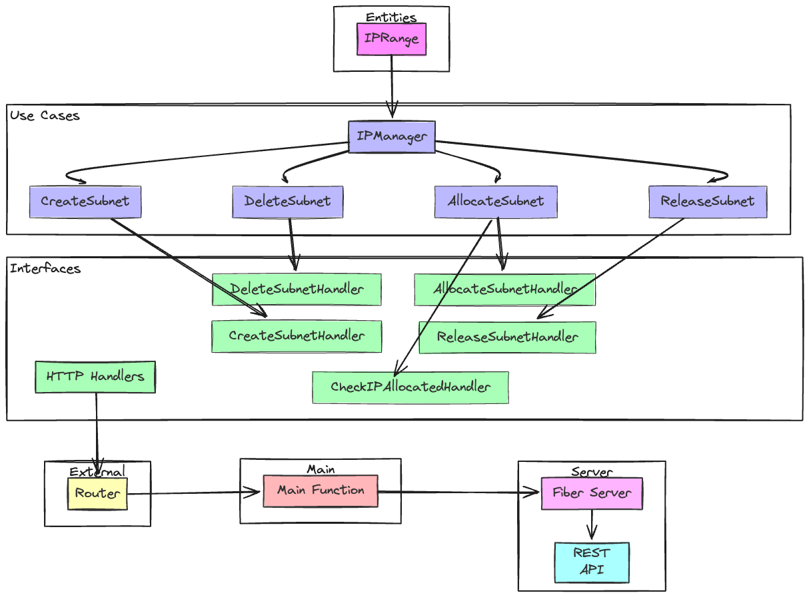

# IP Management System

This IP Management System is designed to provide a RESTful API for managing IP subnets. 
It's built using the Go programming language with the Fiber framework, 
following the Clean Architecture principles to ensure separation of concerns and scalability.

이 IP 관리 시스템은 IP 서브넷을 관리하기 위한 RESTful API를 제공하도록 설계되었습니다.
Fiber 프레임워크와 함께 Go 프로그래밍 언어를 사용하여 만들어졌습니다.
클린 아키텍처 원칙에 따라 만들어 졌으며, 우려사항의 분리와 확장성을 보장합니다.

## Features

- Create IP subnets (등록)
- Delete IP subnets (삭제)
- Allocate IP subnets (할당)
- Release IP subnets (반납)

## Folder Structure
```bash
ip_management/
├── config/
│   └── config.go
├── entities/
│   └── ip_range.go
├── usecases/
│   └── ip_manager.go
├── interfaces/
│   └── http/
│       └── handler.go
├── external/
│   └── http/
│       └── router.go
├── main.go
└── tests/
├── usecases/
│   └── ip_manager_test.go
├── interfaces/
│   └── http/
│       └── handler_test.go
└── external/
└── http/
└── router_test.go
```

## Architecture
This Project based on Clean Architecture.
프로젝트는 Clean Architecture를 기반으로 합니다.
- Enhances scalability and maintainability by decoupling business logic from Interface and external dependencies.
- 비즈니스 로직을 인터페이스 및 외부 의존성과 분리함으로써 확장성과 유지보수성을 향상 시킬 수 있습니다.

- Entity, which is a concept essential to the service, contains IP and Subnet information.
- The UseCase section contains concepts necessary for management.
- The Interface section is a layer for actually operating various scenarios utilized in the UseCase.
- All operations are performed using RestFul API, so the Fiber server is executed and receives API calls to be executed.

- 서비스에 꼭 필요한 기본적인 개념을 정의합니다. IP, Subnet 정보들을 포함하고 있습니다.
- UseCase 부분에서는 관리에 필요한 개념들이 녹아들어 있습니다.
- Interface 부분은 Usecase에서 활용하고 있는 다양산 시나리오들을 실제 동작하기 위한 Layer입니다.
- 모든 동작은 RestFul API로 동작하기에 Fiber 서버가 실행되고 API호출을 받아 실행 되게 됩니다.


## Prerequisites
Before you begin, ensure you have met the following requirements:
- Go 1.15 (상위 버전 사용 추천)
- Fiber framework (V2 사용)
- Testify for testing (Test 라이브러리 사용)

## Installation
Clone the repository to your local machine:
```bash
git clone https://github.com/david.ahn/ip_management.git
cd ip_management

go mod init ip_management

go get github.com/gofiber/fiber/v2
go get github.com/stretchr/testify
go get github.com/spf13/viper@latest
```

## Running the Server
```bash
go mod tidy
go run main.go
```

## Test
```bash
go test ./...
```
You can place the test target at the back and run the test or you can do it through the IDE.

테스트 대상을 뒷부분에 넣고 Test진행 하거나 IDE 통해서도 가능합니다.

## Containerize(Kubernetes)
Multi-Architecture support
- amd64
- arm64
```bash
make build TAG=your-custom-tag
make push TAG=your-custom-tag
```
Even if you skip build and just push, the build command is included. (Require the ECR address)

build 생략하고 Push만해도 build 명령어가 포함 되어 있습니다.(추가 ECR 정보가 필요합니다)


